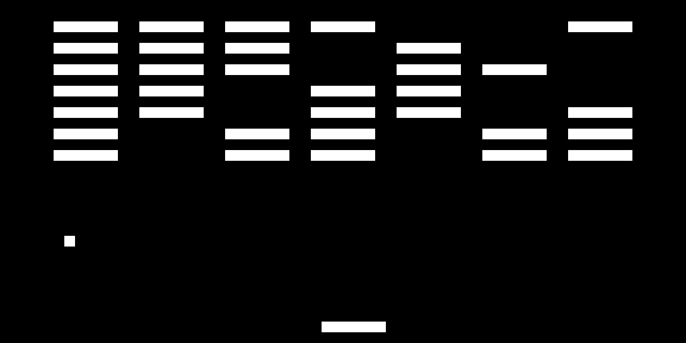

# Chip8 Emulator
This is my second Chip8 emulator, this time it was written in modern C++, with some usage of templates and smartpointers.

## General Information

The emulator is quite simple, it works on the usual CPU interpretation model of fetch, decode, execute.

It implements all the usual Chip8 opcodes, the correcness has been tested against multiple test roms.

In the repository there is a bricks rom for testing.

## Architecture

The emulator is separated in the main Chip8 class, Fonts, Keyboard, Renderer and Screen. Although all of them
could have been implemented in the same file in a procedural way, I opted for implementing them using thin
layers of abstraction with just enough separation, so that most of the specification and configuration of the 
specifications stayed all in the Chip8 class, and the rest is statiated with their respective passed values.

## In Action

This is a screenshot of the emulator working:

